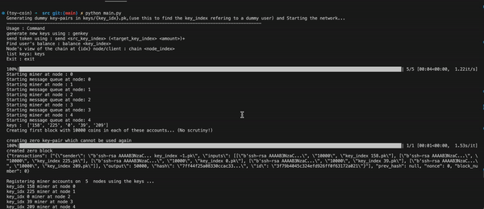

# toy-coin
This is an educational implementation of Satoshi's bitcoin : https://bitcoin.org/bitcoin.pdf 


#### Includes implementations of : <br>
* POW (proof of work)
* Multinode simulator - Each node runs on a thread which performes mining and block validations.
* CMD interface - to send and check out the node's views of the chain (see below)
<hr

#### Use the interface to interact with distributed nodes : <br>

<hr>

####  Setup & Run: 

```
pip install -r requirements.txt 
cd src && python main.py 
```
<i><small>Follow usage instructions ('type enter') to perfom actions on the network</small></i>